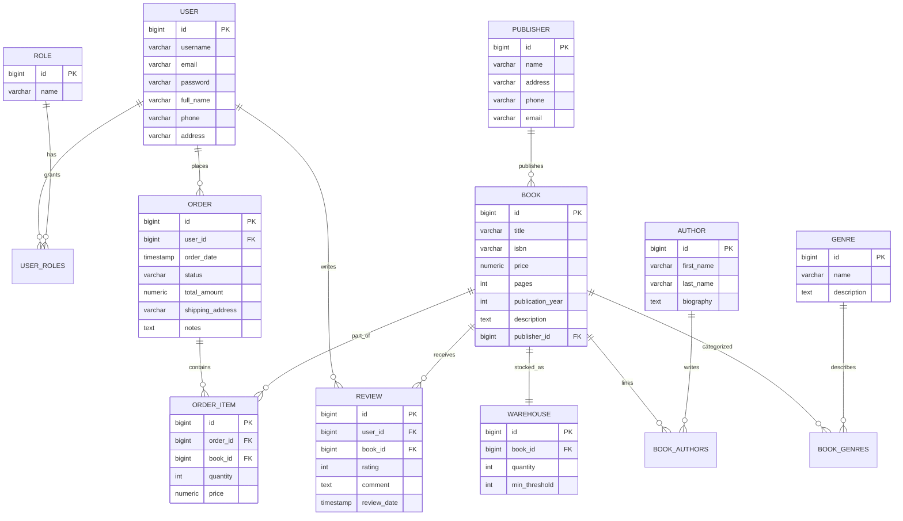

# ОТЧЕТ ПО ИНДИВИДУАЛЬНОМУ ПРОЕКТУ

---

## ТИТУЛЬНЫЙ ЛИСТ

**МИНИСТЕРСТВО НАУКИ И ВЫСШЕГО ОБРАЗОВАНИЯ РОССИЙСКОЙ ФЕДЕРАЦИИ**

**НАЗВАНИЕ УЧЕБНОГО ЗАВЕДЕНИЯ**

**Кафедра информационных технологий**

---

### ИНДИВИДУАЛЬНЫЙ ПРОЕКТ

**Тема:** Система управления книжным магазином с REST API и авторизацией

**По дисциплине:** Учебная практика

**Выполнил:**  
Студент группы П50-2-21  
Фамилия И.О.

**Проверил:**  
Преподаватель  
Фамилия И.О.

---

**Город, 2024**

---

## СОДЕРЖАНИЕ

1. [Введение](#1-введение)
2. [Тема индивидуального проекта](#2-тема-индивидуального-проекта)
3. [Описание предметной области](#3-описание-предметной-области)
4. [Диаграмма базы данных](#4-диаграмма-базы-данных)
   - 4.1. Логическая (инфологическая) модель
   - 4.2. Физическая (даталогическая) модель
5. [Реализация программы](#5-реализация-программы)
   - 5.1. Технологический стек
   - 5.2. Структура проекта
   - 5.3. Модели данных
   - 5.4. REST API контроллеры
   - 5.5. Система авторизации и регистрации
   - 5.6. Валидация данных
   - 5.7. Веб-интерфейс
6. [Демонстрация работы программы](#6-демонстрация-работы-программы)
7. [Заключение](#7-заключение)
8. [Список использованных источников](#8-список-использованных-источников)

---

## 1. ВВЕДЕНИЕ

В рамках учебной практики был разработан индивидуальный проект - система управления книжным магазином. Проект включает в себя все знания и навыки, полученные в ходе выполнения практических работ: создание веб-приложений, работа с базами данных, реализация REST API, система авторизации и регистрации пользователей.

Проект представляет собой полнофункциональное веб-приложение для управления каталогом книг, заказами, складскими остатками с разделением прав доступа для различных ролей пользователей.

---

## 2. ТЕМА ИНДИВИДУАЛЬНОГО ПРОЕКТА

**Система управления книжным магазином с REST API и авторизацией**

### Цель проекта

Разработка веб-приложения для управления книжным магазином, которое обеспечивает:
- CRUD операции с таблицами базы данных (минимум 8 таблиц)
- Связанные таблицы с установленными отношениями
- Валидацию данных на всех уровнях
- Систему авторизации и регистрации
- Разделение пользователей на 3 роли с разным функционалом
- RESTful API для всех операций с базой данных
- Современный веб-интерфейс с использованием Bootstrap

---

## 3. ОПИСАНИЕ ПРЕДМЕТНОЙ ОБЛАСТИ

### 3.1. Описание предметной области

Книжный магазин - это система управления каталогом книг, заказами клиентов и складскими остатками. Система должна обеспечивать:

1. **Управление каталогом книг:**
   - Добавление, редактирование и удаление книг
   - Управление авторами, издательствами и жанрами
   - Поиск книг по различным критериям

2. **Управление заказами:**
   - Создание заказов клиентами
   - Обработка заказов менеджерами
   - Отслеживание статусов заказов

3. **Управление складом:**
   - Контроль остатков книг на складе
   - Установка минимальных порогов остатков

4. **Система пользователей:**
   - Регистрация новых пользователей
   - Авторизация в системе
   - Разделение прав доступа по ролям

### 3.2. Сущности предметной области

1. **Пользователь (User)** - пользователь системы
   - Имя пользователя, email, пароль
   - Полное имя, телефон, адрес
   - Связь с ролями (многие ко многим)
   - Связь с заказами (один ко многим)
   - Связь с отзывами (один ко многим)

2. **Роль (Role)** - роль пользователя в системе
   - Название роли (ADMIN, MANAGER, USER)
   - Связь с пользователями (многие ко многим)

3. **Книга (Book)** - основной товар магазина
   - Название, ISBN, цена, количество страниц
   - Год издания, описание
   - Связь с авторами (многие ко многим)
   - Связь с жанрами (многие ко многим)
   - Связь с издательством (многие к одному)

4. **Автор (Author)** - автор книги
   - Имя, фамилия, биография
   - Связь с книгами (многие ко многим)

5. **Издательство (Publisher)** - издатель книг
   - Название, адрес, телефон, email
   - Связь с книгами (один ко многим)

6. **Жанр (Genre)** - жанр книги
   - Название, описание
   - Связь с книгами (многие ко многим)

7. **Заказ (Order)** - заказ клиента
   - Пользователь, дата заказа, статус
   - Общая сумма, адрес доставки, примечания
   - Связь с позициями заказа (один ко многим)

8. **Позиция заказа (OrderItem)** - товар в заказе
   - Книга, количество, цена
   - Связь с заказом (многие к одному)

9. **Отзыв (Review)** - отзыв на книгу
   - Пользователь, книга, рейтинг (1-5)
   - Комментарий, дата отзыва

10. **Склад (Warehouse)** - остатки на складе
    - Книга, количество, минимальный порог
    - Связь с книгой (один к одному)

### 3.3. Бизнес-процессы

1. **Регистрация и авторизация**
   - Пользователь регистрируется в системе
   - При регистрации автоматически присваивается роль USER
   - Пользователь входит в систему с логином и паролем

2. **Просмотр каталога**
   - Все пользователи могут просматривать каталог книг
   - Возможен поиск книг по названию, автору, жанру

3. **Создание заказа**
   - Пользователь с ролью USER может создавать заказы
   - Заказ содержит одну или несколько книг с указанием количества

4. **Обработка заказов**
   - Менеджер и администратор могут изменять статус заказа
   - Доступные статусы: PENDING, PROCESSING, SHIPPED, DELIVERED, CANCELLED

5. **Управление каталогом**
   - Администратор может добавлять, редактировать и удалять книги
   - Управление авторами, издательствами и жанрами

6. **Управление складом**
   - Менеджер и администратор могут управлять остатками на складе
   - Установка минимальных порогов для контроля остатков

---

## 4. ДИАГРАММА БАЗЫ ДАННЫХ

### 4.1. Логическая (инфологическая) модель

Логическая модель представляет концептуальное описание данных без привязки к конкретной СУБД:



### 4.2. Физическая (даталогическая) модель

Физическая модель описывает структуру таблиц в PostgreSQL:

#### Таблицы и связи:

1. **users** (id BIGSERIAL PRIMARY KEY, username VARCHAR(50) UNIQUE NOT NULL, email VARCHAR(100) UNIQUE NOT NULL, password VARCHAR(255) NOT NULL, full_name VARCHAR(100) NOT NULL, phone VARCHAR(20), address VARCHAR(255))

2. **roles** (id BIGSERIAL PRIMARY KEY, name VARCHAR(50) UNIQUE NOT NULL)

3. **user_roles** (user_id BIGINT NOT NULL REFERENCES users(id) ON DELETE CASCADE, role_id BIGINT NOT NULL REFERENCES roles(id) ON DELETE CASCADE, PRIMARY KEY (user_id, role_id)) - связующая таблица

4. **authors** (id BIGSERIAL PRIMARY KEY, first_name VARCHAR(100) NOT NULL, last_name VARCHAR(100) NOT NULL, biography TEXT)

5. **publishers** (id BIGSERIAL PRIMARY KEY, name VARCHAR(200) UNIQUE NOT NULL, address VARCHAR(255), phone VARCHAR(20), email VARCHAR(100))

6. **genres** (id BIGSERIAL PRIMARY KEY, name VARCHAR(100) UNIQUE NOT NULL, description TEXT)

7. **books** (id BIGSERIAL PRIMARY KEY, title VARCHAR(500) NOT NULL, isbn VARCHAR(17) UNIQUE NOT NULL, price DECIMAL(10,2) NOT NULL, pages INTEGER NOT NULL, publication_year INTEGER NOT NULL, description TEXT, publisher_id BIGINT NOT NULL REFERENCES publishers(id))

8. **book_authors** (book_id BIGINT NOT NULL REFERENCES books(id) ON DELETE CASCADE, author_id BIGINT NOT NULL REFERENCES authors(id) ON DELETE CASCADE, PRIMARY KEY (book_id, author_id)) - связующая таблица

9. **book_genres** (book_id BIGINT NOT NULL REFERENCES books(id) ON DELETE CASCADE, genre_id BIGINT NOT NULL REFERENCES genres(id) ON DELETE CASCADE, PRIMARY KEY (book_id, genre_id)) - связующая таблица

10. **orders** (id BIGSERIAL PRIMARY KEY, user_id BIGINT NOT NULL REFERENCES users(id), order_date TIMESTAMP NOT NULL, status VARCHAR(20) NOT NULL, total_amount DECIMAL(10,2) NOT NULL, shipping_address VARCHAR(255), notes TEXT)

11. **order_items** (id BIGSERIAL PRIMARY KEY, order_id BIGINT NOT NULL REFERENCES orders(id) ON DELETE CASCADE, book_id BIGINT NOT NULL REFERENCES books(id), quantity INTEGER NOT NULL, price DECIMAL(10,2) NOT NULL)

12. **reviews** (id BIGSERIAL PRIMARY KEY, user_id BIGINT NOT NULL REFERENCES users(id) ON DELETE CASCADE, book_id BIGINT NOT NULL REFERENCES books(id) ON DELETE CASCADE, rating INTEGER NOT NULL CHECK (rating >= 1 AND rating <= 5), comment TEXT, review_date TIMESTAMP NOT NULL)

13. **warehouse** (id BIGSERIAL PRIMARY KEY, book_id BIGINT UNIQUE NOT NULL REFERENCES books(id) ON DELETE CASCADE, quantity INTEGER NOT NULL, min_threshold INTEGER)

#### Типы связей:

- **User ↔ Role**: Многие ко многим (через user_roles)
- **User → Order**: Один ко многим
- **User → Review**: Один ко многим
- **Book ↔ Author**: Многие ко многим (через book_authors)
- **Book ↔ Genre**: Многие ко многим (через book_genres)
- **Book → Publisher**: Многие к одному
- **Book → Warehouse**: Один к одному
- **Order → OrderItem**: Один ко многим
- **OrderItem → Book**: Многие к одному
- **Review → Book**: Многие к одному
- **Review → User**: Многие к одному

---

## 5. РЕАЛИЗАЦИЯ ПРОГРАММЫ

### 5.1. Технологический стек

**Backend:**
- Java 17
- Spring Boot 3.2.0
- Spring Data JPA
- Spring Security
- Spring Validation
- PostgreSQL 12+
- Maven

**Frontend:**
- HTML5
- CSS3
- JavaScript (ES6+)
- Bootstrap 5.3.0
- Thymeleaf

**API Documentation:**
- Swagger/OpenAPI 2.3.0

**Дополнительные технологии:**
- BCrypt для шифрования паролей
- Bean Validation (JSR 380)
- Jackson для JSON сериализации

### 5.2. Структура проекта

```
finalLab/
├── src/
│   ├── main/
│   │   ├── java/com/bookstore/
│   │   │   ├── Application.java
│   │   │   ├── config/
│   │   │   │   ├── DataInitializer.java
│   │   │   │   ├── SecurityConfig.java
│   │   │   │   └── SwaggerConfig.java
│   │   │   ├── controller/
│   │   │   │   ├── api/          # REST API контроллеры
│   │   │   │   │   ├── BookController.java
│   │   │   │   │   ├── AuthorController.java
│   │   │   │   │   ├── GenreController.java
│   │   │   │   │   ├── OrderController.java
│   │   │   │   │   └── ...
│   │   │   │   └── web/          # Web контроллеры (UI)
│   │   │   │       ├── HomeController.java
│   │   │   │       ├── AuthController.java
│   │   │   │       ├── AdminController.java
│   │   │   │       └── ...
│   │   │   ├── dto/              # Data Transfer Objects
│   │   │   │   └── UserRegistrationDto.java
│   │   │   ├── exception/        # Обработка ошибок
│   │   │   │   ├── GlobalExceptionHandler.java
│   │   │   │   └── ResourceNotFoundException.java
│   │   │   ├── model/            # Сущности (Entity)
│   │   │   │   ├── User.java
│   │   │   │   ├── Role.java
│   │   │   │   ├── Book.java
│   │   │   │   └── ...
│   │   │   ├── repository/       # Репозитории (JPA)
│   │   │   │   ├── UserRepository.java
│   │   │   │   ├── BookRepository.java
│   │   │   │   └── ...
│   │   │   ├── security/         # Spring Security
│   │   │   │   └── UserDetailsServiceImpl.java
│   │   │   └── service/          # Бизнес-логика
│   │   │       ├── UserService.java
│   │   │       ├── BookService.java
│   │   │       └── ...
│   │   └── resources/
│   │       ├── application.properties
│   │       ├── static/css/
│   │       │   └── style.css
│   │       └── templates/        # Thymeleaf шаблоны
│   │           ├── landing.html
│   │           ├── home.html
│   │           ├── login.html
│   │           ├── register.html
│   │           ├── fragments/
│   │           │   └── header.html
│   │           └── ...
│   └── test/
├── pom.xml
├── create_database.sql
└── README.md
```

### 5.3. Модели данных

#### Пример модели Book:

```java
@Entity
@Table(name = "books")
@JsonIdentityInfo(generator = ObjectIdGenerators.PropertyGenerator.class, property = "id")
public class Book {
    @Id
    @GeneratedValue(strategy = GenerationType.IDENTITY)
    private Long id;
    
    @NotBlank(message = "Название книги обязательно")
    @Size(max = 500, message = "Название книги не должно превышать 500 символов")
    @Column(nullable = false)
    private String title;
    
    @NotBlank(message = "ISBN обязательно")
    @Size(min = 10, max = 17, message = "ISBN должен быть от 10 до 17 символов")
    @Column(unique = true, nullable = false)
    private String isbn;
    
    @NotNull(message = "Цена обязательна")
    @DecimalMin(value = "0.0", inclusive = false, message = "Цена должна быть больше 0")
    @Digits(integer = 10, fraction = 2, message = "Некорректный формат цены")
    @Column(nullable = false, precision = 10, scale = 2)
    private BigDecimal price;
    
    @NotNull(message = "Количество страниц обязательно")
    @Min(value = 1, message = "Количество страниц должно быть больше 0")
    private Integer pages;
    
    @NotNull(message = "Год издания обязателен")
    @Min(value = 1000, message = "Год издания должен быть не менее 1000")
    @Max(value = 2100, message = "Год издания должен быть не более 2100")
    private Integer publicationYear;
    
    private String description;
    
    @ManyToOne(fetch = FetchType.EAGER)
    @JoinColumn(name = "publisher_id", nullable = false)
    private Publisher publisher;
    
    @ManyToMany(fetch = FetchType.EAGER)
    @JoinTable(
        name = "book_authors",
        joinColumns = @JoinColumn(name = "book_id"),
        inverseJoinColumns = @JoinColumn(name = "author_id")
    )
    private Set<Author> authors = new HashSet<>();
    
    @ManyToMany(fetch = FetchType.EAGER)
    @JoinTable(
        name = "book_genres",
        joinColumns = @JoinColumn(name = "book_id"),
        inverseJoinColumns = @JoinColumn(name = "genre_id")
    )
    private Set<Genre> genres = new HashSet<>();
    
    // Getters and Setters
}
```

#### Пример модели User:

```java
@Entity
@Table(name = "users")
public class User {
    @Id
    @GeneratedValue(strategy = GenerationType.IDENTITY)
    private Long id;
    
    @NotBlank(message = "Имя пользователя обязательно")
    @Size(min = 3, max = 50, message = "Имя пользователя должно быть от 3 до 50 символов")
    @Column(unique = true, nullable = false)
    private String username;
    
    @NotBlank(message = "Email обязателен")
    @Email(message = "Некорректный формат email")
    @Column(unique = true, nullable = false)
    private String email;
    
    @NotBlank(message = "Пароль обязателен")
    @Size(min = 8, message = "Пароль должен содержать минимум 8 символов")
    @Column(nullable = false)
    @JsonIgnore
    private String password;
    
    @ManyToMany(fetch = FetchType.EAGER)
    @JoinTable(
        name = "user_roles",
        joinColumns = @JoinColumn(name = "user_id"),
        inverseJoinColumns = @JoinColumn(name = "role_id")
    )
    private Set<Role> roles = new HashSet<>();
    
    // Getters and Setters
}
```

### 5.4. REST API контроллеры

#### Пример REST контроллера для книг:

```java
@RestController
@RequestMapping("/api/books")
@Tag(name = "Books", description = "API для управления книгами")
public class BookController {
    
    @Autowired
    private BookService bookService;
    
    @GetMapping
    @Operation(summary = "Получить все книги", description = "Возвращает список всех книг")
    public ResponseEntity<List<Book>> getAllBooks() {
        return ResponseEntity.ok(bookService.getAllBooks());
    }
    
    @GetMapping("/{id}")
    @Operation(summary = "Получить книгу по ID", description = "Возвращает книгу по указанному ID")
    public ResponseEntity<Book> getBookById(@PathVariable Long id) {
        return ResponseEntity.ok(bookService.getBookById(id));
    }
    
    @PostMapping
    @Operation(summary = "Создать книгу", description = "Создает новую книгу")
    public ResponseEntity<Book> createBook(@Valid @RequestBody Book book) {
        Book created = bookService.createBook(book);
        return ResponseEntity.status(HttpStatus.CREATED).body(created);
    }
    
    @PutMapping("/{id}")
    @Operation(summary = "Обновить книгу", description = "Обновляет существующую книгу")
    public ResponseEntity<Book> updateBook(@PathVariable Long id, @Valid @RequestBody Book book) {
        return ResponseEntity.ok(bookService.updateBook(id, book));
    }
    
    @DeleteMapping("/{id}")
    @Operation(summary = "Удалить книгу", description = "Удаляет книгу по ID")
    public ResponseEntity<Void> deleteBook(@PathVariable Long id) {
        bookService.deleteBook(id);
        return ResponseEntity.noContent().build();
    }
}
```

### 5.5. Система авторизации и регистрации

#### Конфигурация безопасности:

```java
@Configuration
@EnableWebSecurity
public class SecurityConfig {
    
    @Autowired
    private UserDetailsServiceImpl userDetailsService;
    
    @Bean
    public PasswordEncoder passwordEncoder() {
        return new BCryptPasswordEncoder();
    }
    
    @Bean
    public SecurityFilterChain securityFilterChain(HttpSecurity http) throws Exception {
        http
            .authorizeHttpRequests(auth -> auth
                .requestMatchers("/", "/landing", "/register", "/login", "/home", 
                                "/css/**", "/js/**", "/error", 
                                "/swagger-ui/**", "/api-docs/**").permitAll()
                .requestMatchers("/api/**").authenticated()
                .requestMatchers("/web/books").permitAll()
                .requestMatchers("/web/books/new", "/web/books/{id}/edit")
                    .hasAnyAuthority("ROLE_ADMIN", "ROLE_MANAGER")
                .requestMatchers("/web/orders/**")
                    .hasAnyAuthority("ROLE_ADMIN", "ROLE_MANAGER", "ROLE_USER")
                .requestMatchers("/web/warehouse/**")
                    .hasAnyAuthority("ROLE_ADMIN", "ROLE_MANAGER")
                .requestMatchers("/admin/**").hasAuthority("ROLE_ADMIN")
                .requestMatchers("/manager/**")
                    .hasAnyAuthority("ROLE_ADMIN", "ROLE_MANAGER")
                .anyRequest().authenticated()
            )
            .formLogin(form -> form
                .loginPage("/login")
                .defaultSuccessUrl("/home", true)
                .permitAll()
            )
            .logout(logout -> logout
                .logoutUrl("/logout")
                .logoutSuccessUrl("/login?logout=true")
                .permitAll()
            );
        
        return http.build();
    }
}
```

#### Регистрация пользователя:

```java
@PostMapping("/register")
public String register(@Valid @ModelAttribute("user") UserRegistrationDto registrationDto,
                      BindingResult result, Model model) {
    if (result.hasErrors()) {
        return "register";
    }
    
    try {
        userService.registerUser(registrationDto);
        return "redirect:/login?success=true";
    } catch (Exception e) {
        model.addAttribute("error", e.getMessage());
        return "register";
    }
}
```

### 5.6. Валидация данных

Валидация реализована на нескольких уровнях:

1. **Валидация на уровне модели (Bean Validation):**
   - Использование аннотаций `@NotNull`, `@NotBlank`, `@Size`, `@Email`, `@Min`, `@Max`
   - Проверка данных при создании и обновлении сущностей

2. **Валидация на уровне сервиса:**
   - Проверка бизнес-правил (например, уникальность ISBN)
   - Проверка существования связанных сущностей

3. **Валидация на уровне контроллера:**
   - Использование `@Valid` для автоматической валидации
   - Обработка ошибок валидации через `BindingResult`

#### Пример валидации:

```java
@PostMapping
public ResponseEntity<Book> createBook(@Valid @RequestBody Book book) {
    // Автоматическая валидация через аннотации в модели Book
    Book created = bookService.createBook(book);
    return ResponseEntity.status(HttpStatus.CREATED).body(created);
}
```

### 5.7. Веб-интерфейс

#### Лендинг страница:

Создана красивая лендинг страница (`landing.html`) с:
- Hero секцией с призывом к действию
- Секцией статистики
- Описанием возможностей системы
- Информацией о магазине
- Контактной информацией
- Кнопкой "Войти" для перехода к авторизации

#### Главная страница (`home.html`):

- Отображение популярных книг
- Панель управления в зависимости от роли пользователя
- Навигационное меню с разными пунктами для разных ролей

#### Header с разделением по ролям:

```html
<!-- Пункты меню для ADMIN -->
<li class="nav-item" th:if="${isAdmin}">
    <a class="nav-link" th:href="@{/admin}">Панель администратора</a>
</li>
<li class="nav-item" th:if="${isAdmin}">
    <a class="nav-link" th:href="@{/web/books/new}">Управление книгами</a>
</li>

<!-- Пункты меню для MANAGER -->
<li class="nav-item" th:if="${isManager}">
    <a class="nav-link" th:href="@{/manager}">Панель менеджера</a>
</li>
<li class="nav-item" th:if="${isManager}">
    <a class="nav-link" th:href="@{/web/warehouse}">Склад</a>
</li>

<!-- Пункты меню для USER -->
<li class="nav-item" th:if="${isUser}">
    <a class="nav-link" th:href="@{/user}">Мой профиль</a>
</li>
<li class="nav-item" th:if="${isUser}">
    <a class="nav-link" th:href="@{/web/orders}">Мои заказы</a>
</li>
```

---

## 6. ДЕМОНСТРАЦИЯ РАБОТЫ ПРОГРАММЫ

### 6.1. Запуск приложения

1. **Требования:**
   - Java 17 или выше
   - Maven 3.6+
   - PostgreSQL 12+

2. **Настройка базы данных:**
   ```sql
   CREATE DATABASE bookstore_db;
   ```

3. **Настройка application.properties:**
   ```properties
   spring.datasource.url=jdbc:postgresql://localhost:5432/bookstore_db
   spring.datasource.username=your_username
   spring.datasource.password=your_password
   ```

4. **Запуск:**
   ```bash
   cd finalLab
   mvn spring-boot:run
   ```

5. **Доступ к приложению:**
   - Веб-интерфейс: http://localhost:8083
   - Swagger UI: http://localhost:8083/swagger-ui.html

### 6.2. Тестовые пользователи

После первого запуска автоматически создаются следующие пользователи:

| Роль | Имя пользователя | Пароль | Описание |
|------|------------------|--------|----------|
| ADMIN | admin | Admin123! | Полный доступ ко всем функциям |
| MANAGER | manager | Manager123! | Управление заказами и складом |
| USER | user | User123! | Просмотр каталога и создание заказов |

### 6.3. Основные функции системы

#### Для неавторизованных пользователей:

1. **Лендинг страница:**
   - Просмотр информации о магазине
   - Переход к регистрации или авторизации

2. **Просмотр каталога:**
   - Просмотр всех книг
   - Просмотр детальной информации о книге

#### Для пользователя с ролью USER:

1. **Просмотр каталога книг**
2. **Создание заказов**
3. **Просмотр своих заказов**
4. **Оставление отзывов на книги**

#### Для пользователя с ролью MANAGER:

1. **Все функции USER**
2. **Управление заказами:**
   - Просмотр всех заказов
   - Изменение статусов заказов
3. **Управление складом:**
   - Просмотр остатков
   - Обновление количества книг на складе

#### Для пользователя с ролью ADMIN:

1. **Все функции MANAGER и USER**
2. **Управление книгами:**
   - Добавление новых книг
   - Редактирование существующих книг
   - Удаление книг
3. **Управление авторами, издательствами, жанрами**
4. **Управление пользователями**
5. **Просмотр всех заказов**

### 6.4. Примеры работы с REST API

#### Получение всех книг:
```bash
GET http://localhost:8083/api/books
Authorization: Basic <credentials>
```

#### Создание новой книги:
```bash
POST http://localhost:8083/api/books
Content-Type: application/json
Authorization: Basic <credentials>

{
  "title": "Новая книга",
  "isbn": "978-5-17-123456-7",
  "price": 599.00,
  "pages": 400,
  "publicationYear": 2024,
  "description": "Описание книги",
  "publisher": {
    "id": 1
  },
  "authors": [
    {"id": 1}
  ],
  "genres": [
    {"id": 1}
  ]
}
```

#### Обновление книги:
```bash
PUT http://localhost:8083/api/books/1
Content-Type: application/json
Authorization: Basic <credentials>

{
  "title": "Обновленное название",
  "price": 699.00
}
```

#### Удаление книги:
```bash
DELETE http://localhost:8083/api/books/1
Authorization: Basic <credentials>
```

### 6.5. Валидация данных

При попытке создать книгу с некорректными данными система вернет ошибку валидации:

```json
{
  "timestamp": "2024-01-15T10:30:00",
  "status": 400,
  "error": "Bad Request",
  "message": "Ошибка валидации",
  "errors": [
    {
      "field": "title",
      "message": "Название книги обязательно"
    },
    {
      "field": "price",
      "message": "Цена должна быть больше 0"
    }
  ]
}
```

### 6.6. Разделение прав доступа

- Пользователи с разными ролями видят разные пункты меню в header
- Доступ к определенным страницам контролируется Spring Security
- REST API требует аутентификации для всех операций

---

## 7. ЗАКЛЮЧЕНИЕ

В рамках индивидуального проекта была разработана полнофункциональная система управления книжным магазином, которая включает:

1. **Базу данных с 10 таблицами:**
   - users, roles, user_roles
   - books, authors, publishers, genres
   - book_authors, book_genres
   - orders, order_items
   - reviews, warehouse

2. **RESTful API:**
   - Полный набор CRUD операций для всех сущностей
   - Документация через Swagger/OpenAPI
   - Валидация данных на всех уровнях

3. **Систему авторизации и регистрации:**
   - Регистрация новых пользователей
   - Авторизация с использованием Spring Security
   - Разделение прав доступа на 3 роли

4. **Веб-интерфейс:**
   - Красивый лендинг как первая страница
   - Современный дизайн с использованием Bootstrap
   - Адаптивная верстка
   - Разные элементы интерфейса для разных ролей

5. **Валидацию данных:**
   - Валидация на уровне модели (Bean Validation)
   - Валидация на уровне сервиса
   - Обработка ошибок валидации

Проект демонстрирует применение всех знаний, полученных в ходе учебной практики, и представляет собой готовое к использованию веб-приложение.

---

## 8. СПИСОК ИСПОЛЬЗОВАННЫХ ИСТОЧНИКОВ

1. Spring Boot Documentation. - URL: https://spring.io/projects/spring-boot
2. Spring Security Reference Documentation. - URL: https://docs.spring.io/spring-security/reference/
3. Spring Data JPA Documentation. - URL: https://docs.spring.io/spring-data/jpa/docs/current/reference/html/
4. PostgreSQL Documentation. - URL: https://www.postgresql.org/docs/
5. Bootstrap Documentation. - URL: https://getbootstrap.com/docs/5.3/
6. Thymeleaf Documentation. - URL: https://www.thymeleaf.org/documentation.html
7. Swagger/OpenAPI Documentation. - URL: https://swagger.io/docs/
8. Bean Validation Specification (JSR 380). - URL: https://beanvalidation.org/

---

**Приложения:**

1. Скрипт создания базы данных (create_database.sql)
2. Скрипт инициализации тестовых данных (DataInitializer.java)
3. Примеры запросов к REST API
4. Скриншоты работы программы

---

**Дата:** 2024  
**Подпись студента:** _________________  
**Подпись преподавателя:** _________________
